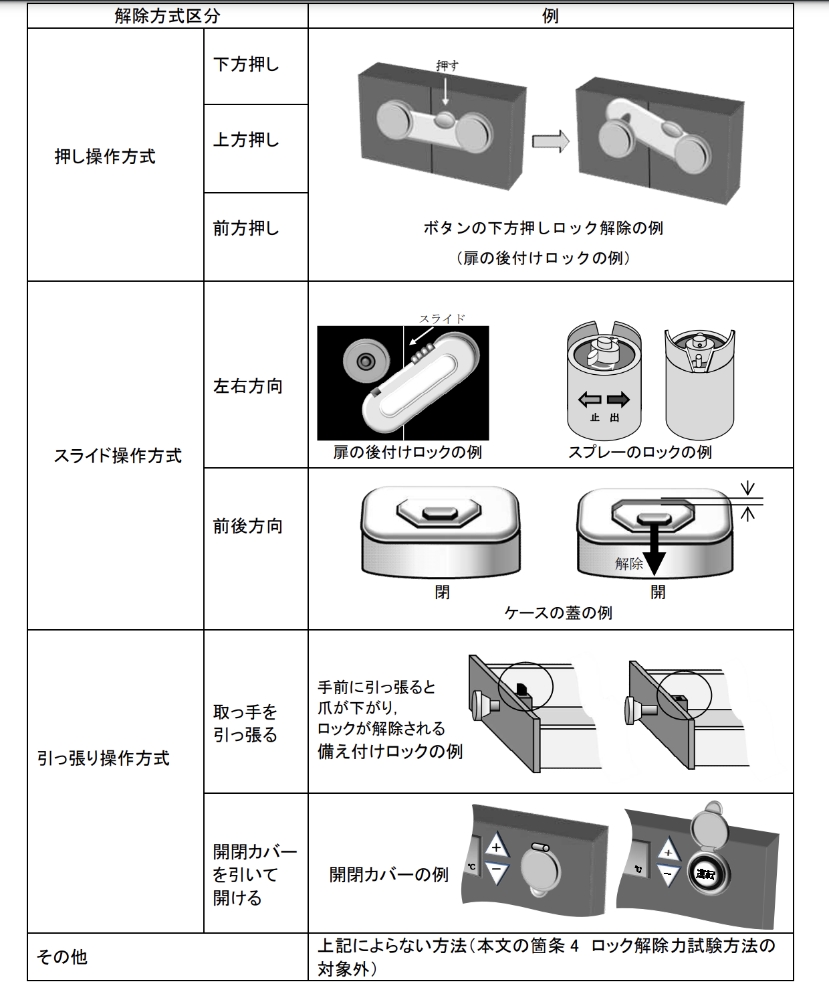
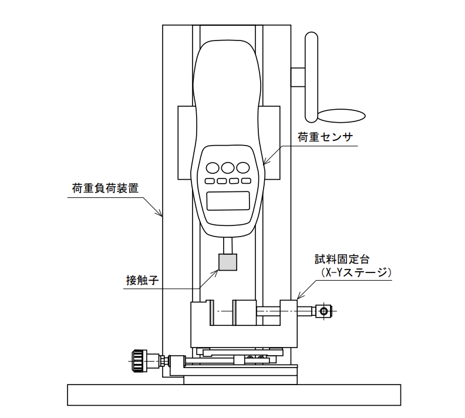
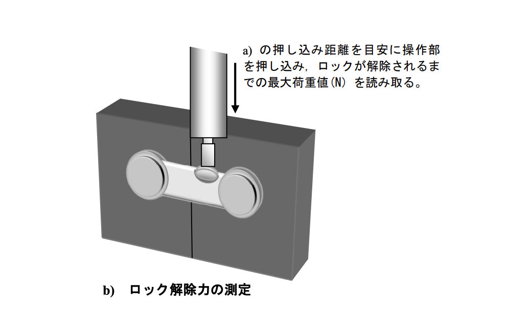
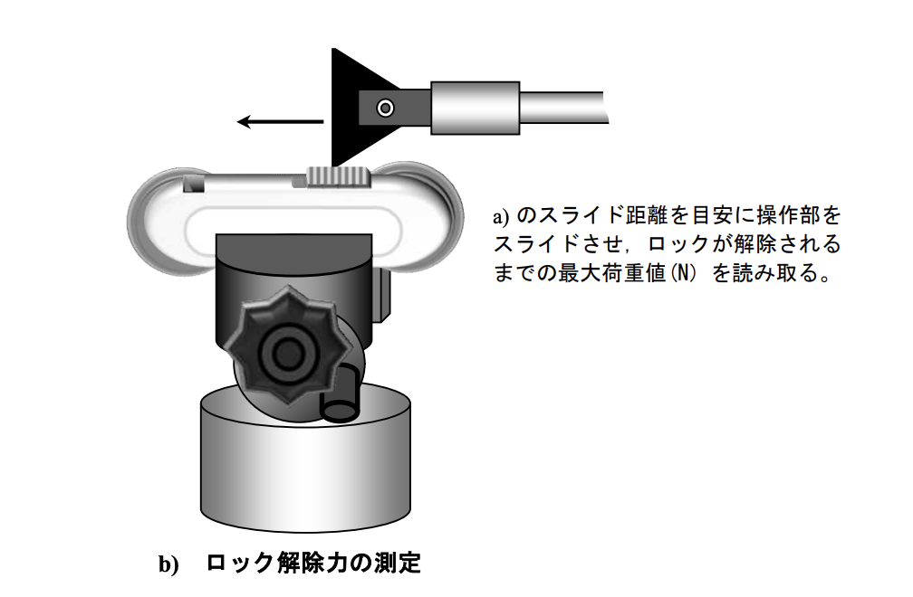
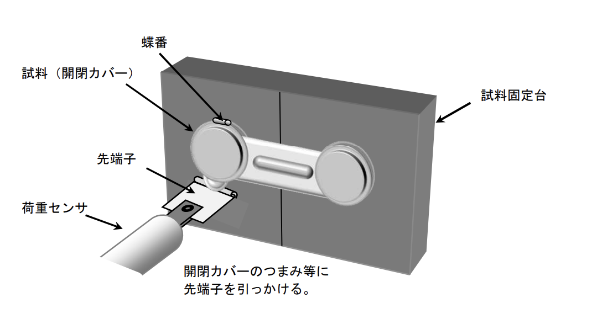

## 調査対象の素材

- どんな素材を用意すべきか？

- どんな形状が良いか？

## 試験方法

https://www.nite.go.jp/data/000100457.pdf

### 一般的には、どんな試験方法があるのか？

- 試験装置

a) 試料固定台 試料固定台は試料の固定・保持に用いる。十分な剛性をもち，試験中に試料がずれたり脱落したりしないものとする。

b) 荷重センサ 操作部に加えられた力を測定するためのセンサで，荷重センサに接触子を取り付け，接触子を介して操作部に力を加え，その反力を測定するもの。荷重負荷装置の駆動部に設置して使う場合もある。
例) 荷重センサには，ロードセル，プッシュプルゲージなどがある

c) 接触子 操作部に直接押し込み力を伝達する治具で，荷重センサと連結して用いる。操作部の形状及び種類ごとに適切なものを用い，試料の操作部以外の部位と干渉しないように工夫を加える。材質は，試験中にたわみ及び変形が生じない材質を用いる。

- 試験手順

a) 試料を試料台に固定する。（必要に応じて，予めロックが解除される位置までの押し込み距離を測定する，解除される位置に印を付けておくなどするとよい。）

b) 再び試料をロックし，荷重センサの接触子を試料の操作部の適切な位置に当て，できるだけ加速を生じないようにして操作部を押し込み，ロックが解除されるまでの最大荷重値（N）を小数第 1 位まで測定する。測定は 3 回行い，その平均値を四捨五入して，小数点第 2 位までを丸めた値をロック解除力
とする。

- 上から押して解除するタイプの試験

- 横にスライドして解除するタイプの試験

- 開閉して解除するタイプの試験

- 市販で定量的に測定でき、再現性が担保される方法は何か？

- どんな項目を使って、評価したら良いか？

  - 子供の外しにくさ

    - 力
    - ロックの段階
      - 1 段階
      - 2 段階
      - 3 段階

  - 親の外しやすさ

    - 3 回計測し、かかった秒数

  - テープの強力さ

  - 互換性 (洗濯機、冷蔵庫など)

    - 長さ調節
      - できる
      - できるけど手間がかかる
      - できない
    - 段差
    - 設置場所
      - ドラム式洗濯機
      - 冷蔵庫
      - 引き戸
      - 引き出し

  - デザイン

    - 大きさ
    - 見た目

  - テープの剥がれにくさ
    - 強い
    - 普通
    - 弱い

- 重みつけは？

- ５段階で評価した時に、どんな基準を作るか？

- 実地調査を、どうやって行うか？
