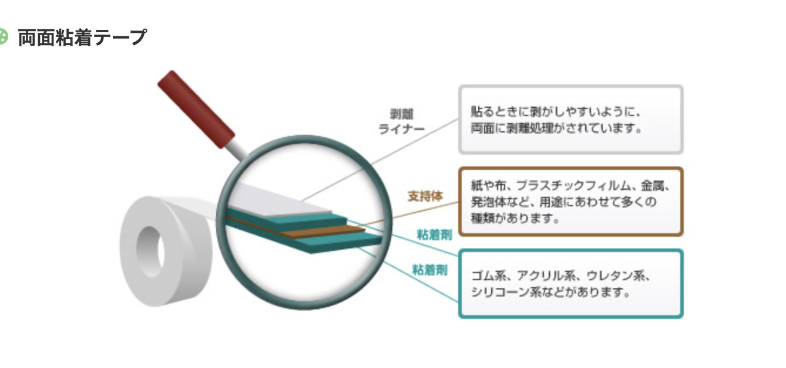
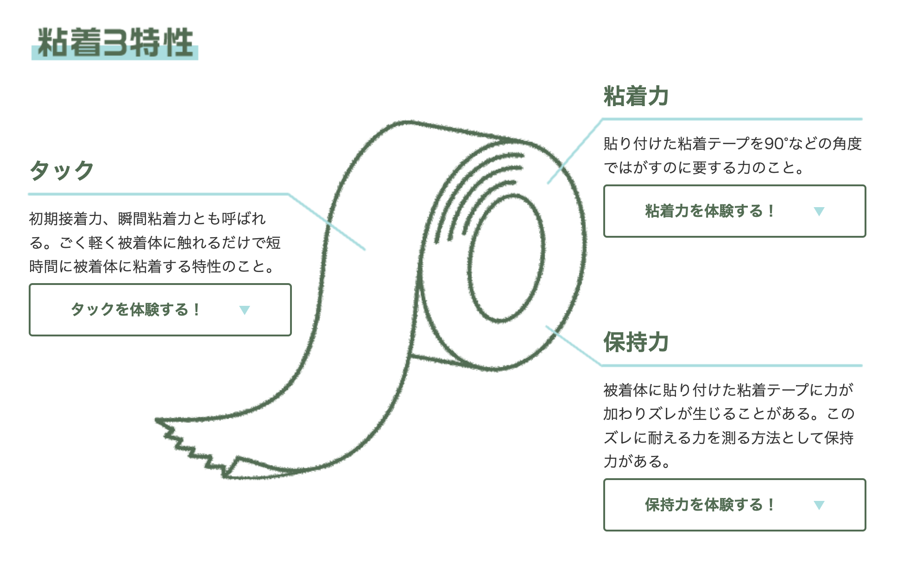
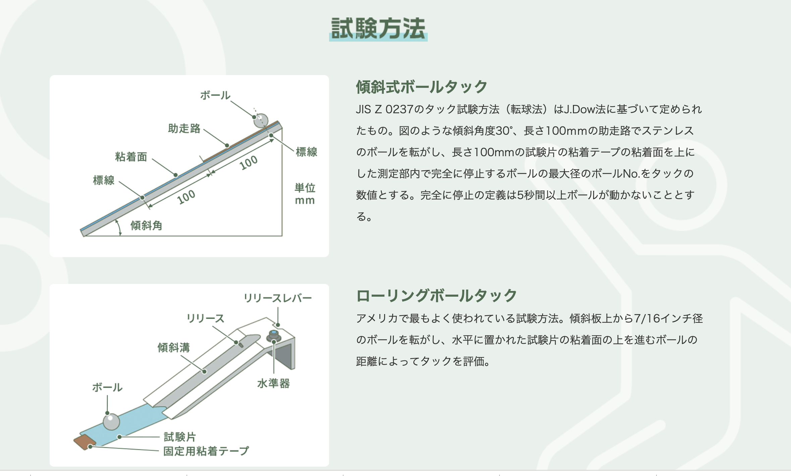
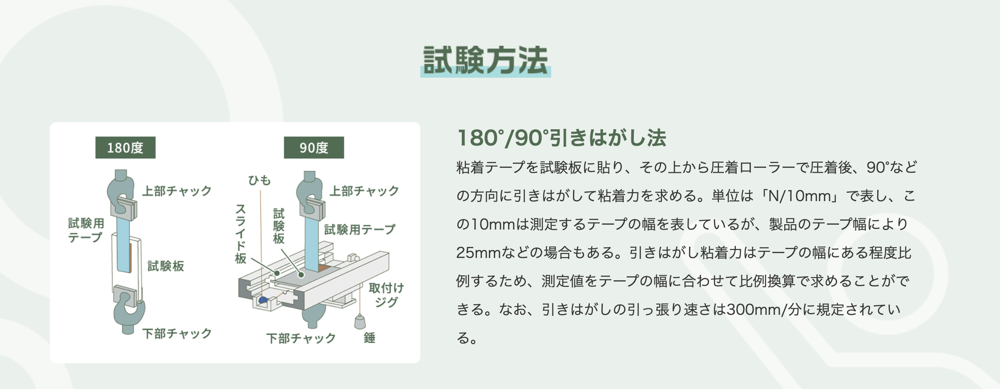
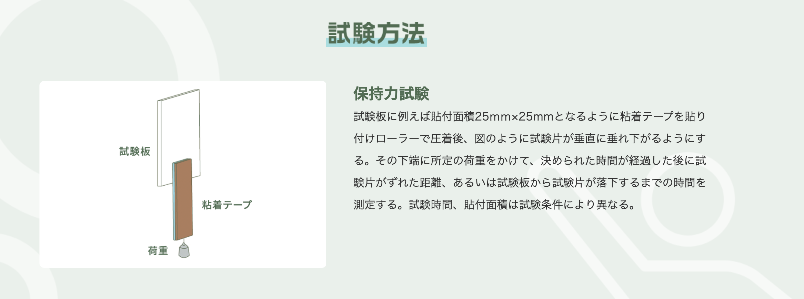
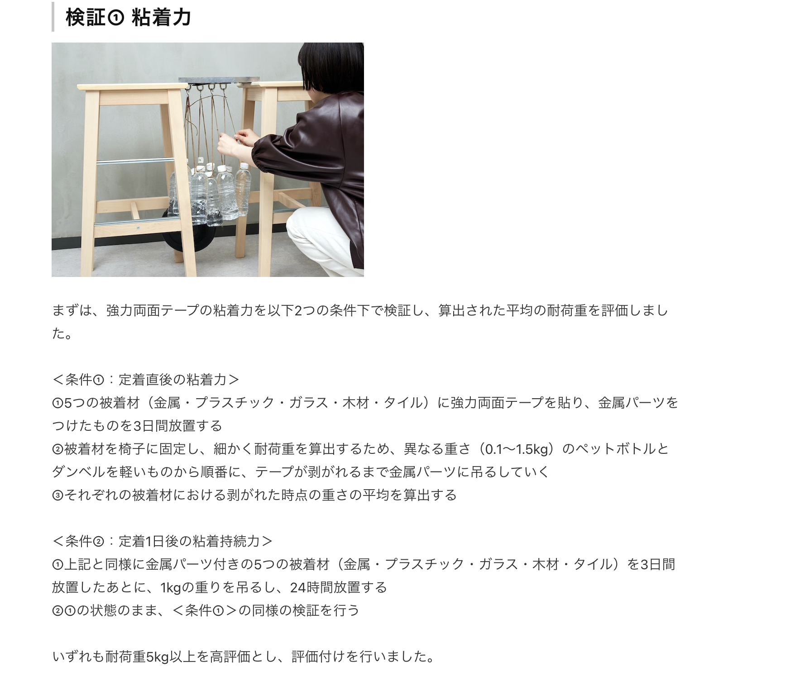

## 調査対象の素材

・どんな素材を用意すべきか？

・どんな形状が良いか？

 

## 粘着テープの構造

現在、私たちが使っている粘着テープのほとんどは、紙や布に粘着剤を塗っただけ･･･ではない。より使いやすく、さまざまな用途で使うために、支持体、粘着剤、下塗り剤、背面処理剤（剥離ライナー）といった層から構成されています。これらの組み合わせによって、粘着テープは数千種類あると言われている。

粘着力は貼る相手（被着体）によって大きく変わる。金属板と樹脂板、平滑面と粗面（木材など）では大きく数値が異なります。

- テープを綺麗に剥がすテクニック

https://www.nitto.com/jp/ja/tapemuseum/science/abrasion01.html

 

## 粘着テープの特性

https://www.nitto.com/jp/ja/tapemuseum/special/vol26/

- 粘着テープの特性評価は、「粘着力」「タック」「保持力」で示されることが多い。

 

## 粘着テープの試験方法

 

### JIS 　 Z 0237:2022 粘着テープ・粘着シート試験方法

https://jis.eomec.com/jisz02372022

- 粘着力の試験方法

- 保持力の試験方法

  - 1000g の試験用のおもりを用いる
  - テープは、幅 8-25mm、長さ 150mm を用意する
  - テープを 8-25mm の長さ分、試験板の上に置く
  - テープの上から、ローラで２往復、10mm/s の速さで圧着させる
  - 圧着後 1 分以内に、垂直に垂れ下がるようにし、テープ下端 40-60mm を折る
  - 折り重ねたテープに、おもりをつける
  - おもりをつけて、テープが試験いたから完全に剥がれ落ちるまでの経過時間を測定
  - 落下しない場合は、所定時間後のずれた距離を測る

 

### ニトムズの試験方法

https://www.nitto.com/jp/ja/rd/base/adhesive/estimate/

- タックの試験方法

- 粘着力の試験方法

https://www.nitto.com/jp/ja/products/double/041/

https://www.youtube.com/watch?v=wmdCKWQ2L6g

https://www.pmda.go.jp/files/000164569.pdf

- 保持力の試験方法

https://www.youtube.com/watch?v=ggQsc4GILWs

- 試験についての追加資料

https://techtimes.dexerials.jp/bonding/test-for-functional-tape/

- 保持力試験は、おもり 1kg

・市販で定量的に測定でき、再現性が担保される方法は何か？

https://www.tsukuba.ac.jp/community/students-kagakunome/shyo_list/2007/chu_8.pdf

JIS 規格のように、90 度、180 度でやると、どちらのテープも剥がれやすく、重さの微妙な調整が必要になり、安定した結果が出なかった。0 度は、テープが強力すぎた。そこで 45 度で実験を行っている。

https://my-best.com/16374

・どんな項目を使って、評価したら良いか？

- 粘着力

- 保持力

- 耐水性

- 耐熱性

- 耐寒性

・5 段階で評価した時に、どんな基準を作るか？

・実地調査を、どうやって行うか？
